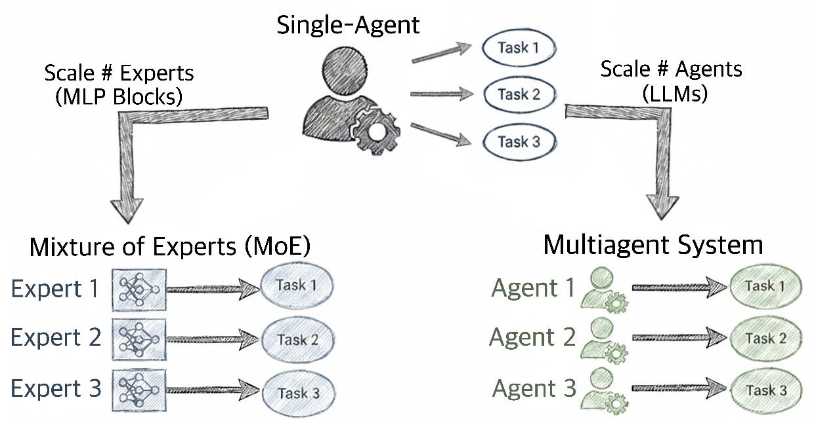
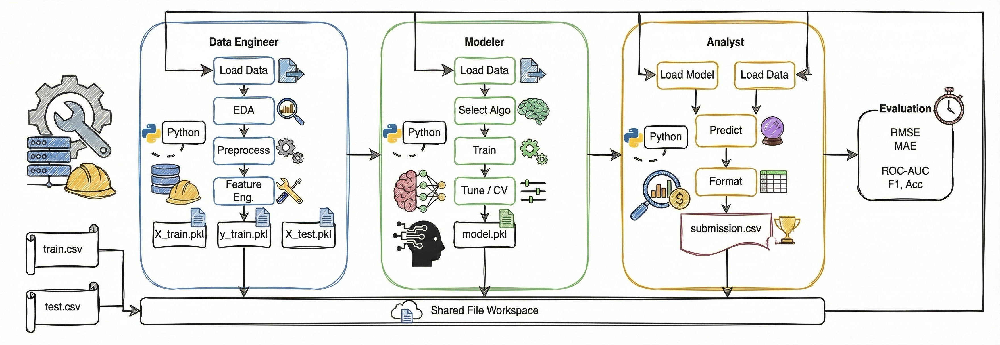
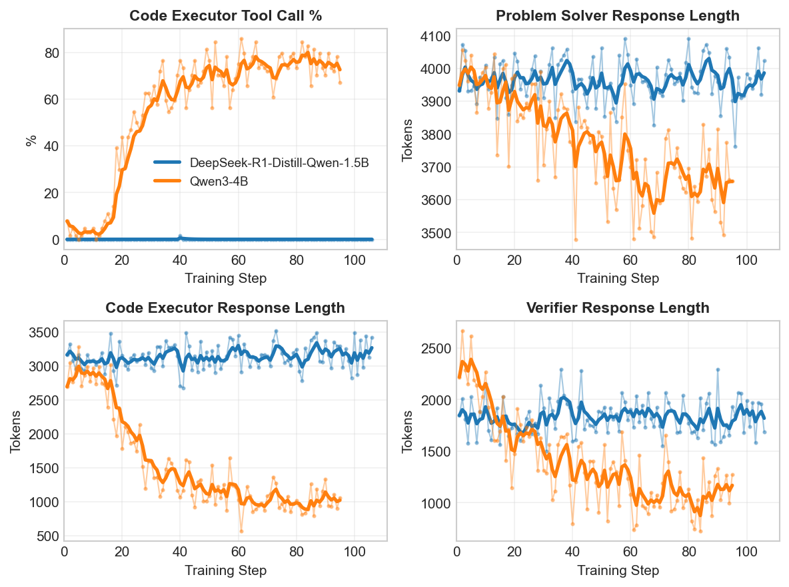

<style>
body {
  font-size: 22px !important;
  line-height: 1.9 !important;
  max-width: 900px !important;
  margin: 0 auto !important;
  padding: 20px !important;
}

h1 {
  font-size: 1.8em !important;
  line-height: 1.3 !important;
}

h2 {
  font-size: 1.4em !important;
  margin-top: 2.5em !important;
  line-height: 1.4 !important;
}

h3 {
  font-size: 1.2em !important;
  line-height: 1.5 !important;
}

p, li {
  font-size: 22px !important;
  line-height: 1.9 !important;
}

blockquote p {
  font-size: 22px !important;
}

code {
  font-size: 20px !important;
}

pre code {
  font-size: 18px !important;
}

h1 code {
  font-size: 0.9em !important;
}

h2 code {
  font-size: 0.9em !important;
}

h3 code {
  font-size: 0.9em !important;
}

code:not([class]) {
  background-color: transparent !important;
  color: inherit !important;
  padding: 0 !important;
  border: none !important;
  font-weight: bold !important;
  font-size: 1em !important;
}
</style>

# MAPPA: Scaling Multiagent Systems with Process Rewards

<p align="center">
  <a href="https://github.com/freephdlabor/mappa">
    
  </a>
  <a href="https://github.com/freephdlabor/mappa">
    
  </a>
  <a href="https://arxiv.org/abs/XXXX.XXXXX">
    
  </a>
</p>

**TLDR:** End-to-end finetuning of multiagent systems may offer a path to continual learning—different agents can specialize without catastrophic forgetting. Yet doing so remains challenging due to credit assignment and sample efficiency. By leveraging AI feedback as per-action process rewards, we demonstrate substantial improvements on long-horizon tasks including multi-step data science pipelines.

---

When a three-agent pipeline fails, who's to blame? The planner who gave bad directions? The coder who introduced a bug? Or the synthesizer who misread the output?

This turns out to be a surprisingly hard question. Traditional training gives you a single bit of feedback—success or failure—after the whole team finishes. Everyone gets the same grade, regardless of who actually dropped the ball.

We found a better way: give each agent its own coach.



*Multiagent systems sidestep catastrophic forgetting the same way mixture-of-experts does—by giving different skills different parameters.*

| Domain | What we tested | How much it improved |
|--------|------|-------------|
| MathChat | Competition math (AIME) | **+5 to +17 percentage points** |
| MathChat | Competition math (AMC) | **+8 to +17 percentage points** |
| DSBench | Classification pipelines | **+12pp** success, **+23%** accuracy, **+38%** F1 |
| DSBench | Regression pipelines | **+25pp** success, **-41%** RMSE |

We call this approach **MAPPA**: training **M**ulti**A**gent systems with **P**er-action **P**rocess rewards from **A**I feedback.

---

## Why bother with multiple agents?

Here's something frustrating about training large models: teach them to code better, and their poetry often gets worse. Fine-tune for reasoning, and creative writing suffers. All skills compete for the same parameters—the classic catastrophic forgetting problem.

Multiagent systems offer an elegant escape. When you split a task across three specialized agents—each with its own weights—improving one agent's coding can't possibly hurt another's reasoning. They're literally different models.

```
Single Model:      [All params] → Output
                   ↑ interference between skills

Multiagent:        [Agent 1: Solver] ─┐
                   [Agent 2: Coder]  ─┼→ Pipeline → Output
                   [Agent 3: Verifier]┘
                   ↑ separate params, no interference
```

The agents don't need to be large. Three 4B-parameter specialists working together give you 12B total parameters, each laser-focused on what it does best. In our MathChat system:

- The `ProblemSolver` drafts mathematical reasoning
- The `CodeExecutor` writes and debugs Python to verify solutions
- The `Verifier` extracts and formats the final answer

We found this trio can outperform a single 4B model trying to do everything. You also get a nice debugging bonus: when something breaks, you can see exactly *which* agent broke it.

This isn't just our intuition. Recent work from Kim et al.[^1] found that reasoning models trained purely for accuracy spontaneously develop diverse internal "personas." Multiagent systems make this specialization explicit—and trainable.

### But you can't just prompt your way there

There's a catch. You can't simply assign different system prompts and call it collaboration.

| | Prompt Engineering | Training Together |
|--------|-------------------|-----------------|
| Specialization | Surface-level personas | Deep weight changes |
| Adaptation | None | Continuous improvement |
| Coordination | Hope it emerges | Learn it explicitly |
| Ceiling | Limited by base model | Can exceed base model |

The real power comes from training agents *together*, end-to-end, so they learn to produce outputs that actually help their teammates.

Something interesting happened in our experiments: the `ProblemSolver` gradually learned to structure its reasoning in ways the `CodeExecutor` could actually use. This coordination never would have emerged from prompting alone.

### Why end-to-end training matters more than you'd think

You might wonder: why not just fix the upstream agents and train downstream ones on their outputs?

The problem is subtle but deadly. Synthetic inputs cover only a tiny fraction of what agents will actually encounter. Train your downstream agent on artificial inputs, and it fails when it meets real upstream outputs at deployment. The distribution mismatch kills you.

End-to-end rollouts sample from the *actual* distribution of intermediate states. Each agent sees exactly what it will encounter in production.

The cost? You have to roll out the entire pipeline for each training sample.

---

## The one-bit problem


*With per-action evaluation, every step gets feedback—not just the final outcome.*

Traditional reinforcement learning gives you a single reward when the whole pipeline finishes. Success or failure. One bit of information from a rollout that took 30+ seconds and involved dozens of actions across multiple agents.

Think about the economics:

- A DSBench run involves 3 agents × up to 4 turns × code execution
- Training needs thousands of these rollouts
- At $0.001 per inference call, costs compound fast

And what do you get? A single bit telling you whether the team succeeded.

```
Traditional RL:
  Rollout 1: [Good] → [Good] → [Bug] → FAIL → Reward: 0
  Rollout 2: [Good] → [Bad]  → [...]  → FAIL → Reward: 0
  Rollout 3: [Good] → [Good] → [Good] → SUCCESS → Reward: 1

  Learning signal: 1 bit from 3 expensive rollouts
```

A rollout with 8 good actions and 1 catastrophic bug looks identical to one where everything was garbage. All that nuance—flattened into a single zero.

Recent work[^2] shows that even failures teach *something*—negative samples redistribute probability mass away from wrong answers. But that's cold comfort when you can't tell *what* went wrong or *where*.

### When the wrong agent gets blamed

Here's a concrete example of why this matters. Our data science pipeline fails with `FileNotFoundError: X_test.pkl not found`:

```
Pipeline: DataEngineer → Modeler → Analyst
Error appears in: Analyst's code

Who's actually at fault?
- DataEngineer forgot to save X_test.pkl  ← THE CULPRIT
- Modeler used the wrong file path?
- Analyst wrote buggy loading code?
```

With shared outcome rewards, all three agents get penalized equally. The `DataEngineer`—who caused the problem—learns nothing specific. The `Analyst`—who did nothing wrong—gets blamed anyway.

This gets worse when you consider the full taxonomy of failure modes:

- **Hidden dependencies**: The `Analyst` can't know the `DataEngineer` was *supposed* to save that file
- **Error propagation**: One mistake cascades through everything downstream
- **Silent failures**: Bad preprocessing might not crash—it just produces garbage
- **Outcome entanglement**: Success requires *every* agent to succeed

Traditional solutions—centralized critics, counterfactual reasoning, shaped rewards—get complicated fast and don't generalize well to language model state spaces.

We needed something simpler.

---

## What if we just asked someone to watch?

Here's the idea: instead of waiting until the end to find out what went wrong, have an LLM *coach* evaluate every action as it happens.

We deliberately chose the word "coach" over "judge." A judge evaluates final outputs against a rubric. A coach watches the game in progress and gives feedback on each play.

| | LLM-as-Judge | LLM-as-Coach |
|--|--------------|--------------|
| **Timing** | After everything's done | During execution |
| **Scope** | Final outputs only | Each action |
| **Feedback** | Pass/fail | "Here's what could improve" |
| **Analogy** | Exam grader | Sports coach mid-game |

The coach asks: *"Given what you knew and what your job was, did this move help the team?"*

Not: *"Did you win?"*

### The coach can read the receipts

Here's where it gets interesting. The coach sees something the agents don't fully appreciate: **tool observations**. When code runs, stdout and stderr create a paper trail of what actually happened.



*Agents in our DSBench pipeline pass files to each other—creating evidence the coach can examine.*

For each agent action, the coach receives:

1. The overall task description
2. The agent's specific role
3. What the agent saw before acting
4. What the agent generated
5. Tool output: stdout, stderr, error messages
6. Ground truth (optional, for final verification)

When the `Analyst` crashes with `FileNotFoundError`, the coach can check: did the `DataEngineer`'s tool output ever mention saving `X_test.pkl`?

If not, blame goes upstream. If yes, the `Analyst` probably has a bug.

No counterfactuals needed—just reading the receipts.

```
DATAENGINEER evaluation:
- Tool output: "Saved X_train.pkl, y_train.pkl"
- No mention of X_test.pkl
- VERDICT: Failed to save required artifact
- SCORE: 3/10

MODELER evaluation:
- Received expected files
- Tool output: "Saved model.pkl successfully"
- VERDICT: Performed correctly given inputs
- SCORE: 8/10

ANALYST evaluation:
- Required file was never created upstream
- Correctly attempted to load it
- VERDICT: Not at fault
- SCORE: 6/10
```

Credit assignment emerges naturally from giving the coach the right context. We didn't have to build explicit machinery for it.

### Coaches handle messy real-world evaluation

For math problems, checking answers sounds simple—until you realize "0.5" and "1/2" and "50%" are all the same thing, but string matching says they're different.

Tools like Math-Verify[^3] use symbolic math to handle some cases, but LLM coaches generalize naturally across formats, natural language variations ("the answer is 42" vs just "42"), and even partial correctness.

For data science, it's messier. A model might achieve 89% accuracy but 23% F1—which sounds contradictory until you realize it's just predicting the majority class. Naive metric averaging would call this "decent":

```
Simple average: (0.89 + 0.23 + 0.78) / 3 = 0.63 → "Decent!"
```

Wrong. This is a failure. The model learned to predict the majority class, not the actual signal.

The coach understands this:

```
Coach reasoning:
High accuracy (0.89) but very low F1 (0.23)
= classic class imbalance problem.

This is a FAILURE despite the good-looking accuracy.
PROCESS_SCORE: 4/10
```

Real-world data is noisy and heterogeneous. Pre-defined weighting schemes can't anticipate every situation. The coach provides contextual judgment that simple averaging cannot.

---

## What we found

### Competition math got substantially better

| Model | Benchmark | Before | After | Improvement |
|-------|-----------|--------|-------|------|
| DeepSeek-R1-1.5B | AMC | 60.9% | 78.1% | **+17pp** |
| DeepSeek-R1-1.5B | AIME | 24.2% | 29.2% | **+5pp** |
| Qwen3-4B | AMC | 78.1% | 85.9% | **+8pp** |
| Qwen3-4B | AIME | 49.2% | 66.7% | **+17pp** |



*The larger model didn't just get more accurate—it changed how it worked.*

The bigger Qwen3-4B model surprised us. It didn't just improve accuracy—it **changed its behavior**. Tool usage jumped from 40% to 80%. Response lengths dropped by nearly half.

The model learned to leverage computation instead of rambling, and to be concise instead of verbose.

The smaller 1.5B model improved accuracy without these qualitative shifts. Apparently you need enough capacity to develop new strategies, not just refine existing ones.

### Data science pipelines improved across the board

| Metric | Before | After | Change |
|--------|--------|-------|--------|
| Success Rate | 50% | 67% | **+17pp** |
| F1 (Fair) | 0.126 | 0.174 | **+38%** |
| RMSE (Fair) | 24.9% | 14.6% | **-41%** |

### But we discovered something unexpected about our coach

Here's something we weren't looking for: our coach had preferences we didn't program.

While analyzing training dynamics, we noticed regression tasks kept improving while classification stagnated. Digging into the scores, we found a systematic bias: regression actions were scored **0.5–1.8 points higher** than equivalent classification actions.

The agents figured this out before we did.

Over training, they specialized toward regression—maintaining 87.5% success on those tasks while classification dropped back to baseline. The coach's unconscious preference got amplified through training.

This is both a limitation and a lesson: **coach biases compound**. If you're using LLM evaluation for training, you need to monitor for exactly this kind of drift.

---

## What's next

We showed you can train multiagent systems end-to-end using process rewards from an LLM coach. Dense per-action feedback solves credit assignment, improves sample efficiency, and works across domains.

The bigger picture: we think scaling specialized agents—not just scaling single models—is a promising direction for complex tasks. A strong general model serves as coach to a team of smaller specialists that can collectively exceed what the coach could do alone.

But we're still figuring out several things:

- **Stateful coaching**: Our coach evaluates each action in isolation. It can't detect its own systematic biases. A smarter coach might notice "I've been scoring regression higher—should I adjust?"

- **Reward backpropagation**: Instead of evaluating each action independently, trace backward from outcomes to find root causes.

- **Beyond scalar rewards**: Coaches could generate *corrected* actions, not just scores—enabling hybrid RL+SFT approaches.

- **Coach-computed metrics**: Let the coach call tools to compute whatever diagnostics it needs, rather than us deciding what metrics to pass.

Current limitations worth noting:
- Coach quality bounds what agents can learn
- Computational cost runs ~$50-150 per training run in API calls
- Stateless evaluation misses temporal patterns

We're entering an era where AI systems increasingly involve multiple agents working together. Figuring out how to train and evaluate these systems is becoming critical.

This is our first step toward making that tractable.

---

## Citation

```bibtex
@article{mappa2026,
  title={MAPPA: Scaling Multiagent Systems with Process Rewards},
  author={Anonymous},
  journal={arXiv preprint arXiv:XXXX.XXXXX},
  year={2026},
  url={https://anonymous.4open.science/r/ANONYMOUS}
}
```

---

## References

[^1]: Kim, T., et al. (2026). *Reasoning Models Generate Societies of Thought*. arXiv preprint.

[^2]: Anonymous. (2025). *The Surprising Effectiveness of Negative Reinforcement in LLM Reasoning*. arXiv preprint arXiv:2506.01347. [https://arxiv.org/abs/2506.01347](https://arxiv.org/abs/2506.01347)

[^3]: Gandenberger, G. (2025). *Math-Verify: Symbolic Math Verification for LLM Outputs*. [https://gandenberger.org/posts/2025-02-20_til_math-verify/til_math-verify.html](https://gandenberger.org/posts/2025-02-20_til_math-verify/til_math-verify.html)
